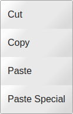
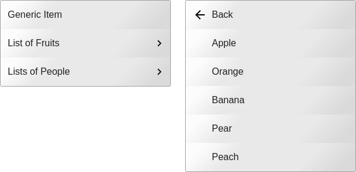

# webapp-menu

Quickly create accessible menus for in web apps.  Eg. context menu, file menu, edit menu, toolbar.  The library handles adding the appropriate ```aria-``` attributes and the keyboard and focus interaction.  

No framework dependencies.  It is written in with vanilla JS and can be used with any framework.

## Live Demos

[Web App Menu site](https://webapp-menu.netlify.com/)

[Storybook](https://webapp-menu.netlify.com/storybook)

<!--
```
<custom-element-demo>
  <template>
  <script type="module"  src="https://unpkg.com/webapp-menu@^3/dist/webapp-menu.js"></script>
    <button id="show-it">Show Menu</button>
    <wam-popup controlled-by="show-it">
        <wam-item label="Cut"></wam-item>
        <wam-item label="Copy"></wam-item>
        <wam-item label="Paste></wam-item>
        <wam-separator></wam-separator>
        <wam-item label="Delete"></wam-item>
    </wam-popup>
  </template>
</custom-element-demo>
```
-->

## Screenshots

### Toolbar

[](https://webapp-menu.netlify.com/)

### Popup

[](https://webapp-menu.netlify.com/)

### Nested Menu

[](https://webapp-menu.netlify.com/)


## Setup

### HTML

Include the Javascript in your HTML as a module import.

```html
<script type="module" src="https://unpkg.com/webapp-menu@^3/dist/webapp-menu.js"></script>
```

### NPM

```
npm install --save webapp-menu
```

Include the file in your code:

```javascript
import 'webapp-menu';
```

## Usage

The menu components can be configured using either HTML or JavaScript.

See the [storybook examples](https://webapp-menu.netlify.com/storybook/) for more details.

### Using HTML

```html
<wam-popup controlled-by="some-button-id">
    <wam-item label="Text Only"></wam-item>
    <wam-item label="Text with Icon" icon="hello.png">
    </wam-item>
</wam-popup>
```

### Using JavaScript

```javascript
const items = [
    {label:'Text Only'}
    {label:'Text with Icon', icon:'hello.png'},
];

const menu = document.createElement('wam-popup');
menu.items.set(items);
menu.controlledBy = document.getElementById('some-button-id');
```

## History

See [CHANGES.md](./CHANGES.md).
