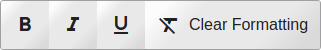

# webapp-menu

Quickly create accessible menus for in web apps.  Eg. context menu, file menu, edit menu, toolbar.  The library handles adding the appropriate ```aria-``` attributes and the keyboard and focus interaction.  


 No framework dependencies.  It is written in with vanilla JS and can be used with any framework.

## Screenshots

<div style="display:flex;flex-wrap:wrap">
<div style="margin-right:1rem">
Toolbar


</div><div style="margin-right:1rem">
Popup


</div><div style="margin-right:1rem">
Nested Menu

 
</div>
</div>

## Setup

### HTML

Include the Javascript in your HTML as a module import.

```html
<script type="module"  src="https://unpkg.com/webapp-menu@^2/dist/webapp-menu.js"></script>
```

### NPM

```
npm install --save webapp-menu
```

Include the file in your code:

```javascript
import Menu from 'webapp-menu';
```

## Usage

### Using HTML

```html
<wam-popup controlledBy="some-button-id">
    <wam-item label="Text Only"></wam-item>
    <wam-item label="Text with Icon">
        </span>
    </wam-item>
</wam-popup>
```

### Using JavaScript

```javascript
function iconFactory(icon) {
    const img = document.createElement('img');
    img.src = icon;
    return img;
}

const items = [
    {label:'Text Only'}
    {label:'Text with Icon', icon:'hello.png'},
];

const controlledBy = document.getElementById('some-button-id');

const menu = Menu.Popup.create({
    iconFactory, 
    items,
    controlledBy
});
